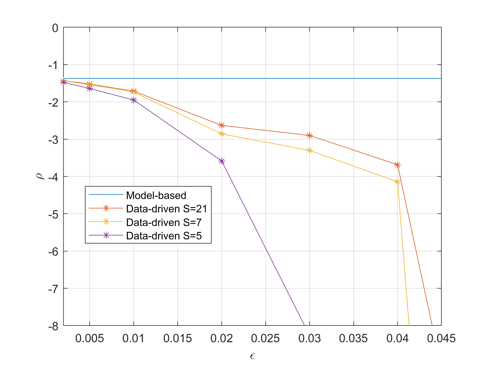

# Data Driven Dissipativity Verification for a Mass-Spring-Damper system
This repo provides code for Example 6.4.

## Dependencies
This code is developed and tested in MATLAB. You will need the following.
```Dissipativity_verification.m``` requires ```YALMIP``` and SDP solvers (e.g., ```MOSEK```, ```SeDuMi```)


``` YAlMIP ```: Download at https://yalmip.github.io/download/

```SeDuMi```: Download at [SeDuMi download page](https://github.com/sqlp/sedumi)

```MOSEK```: Download at https://www.mosek.com/. License can be requested at https://www.mosek.com/products/academic-licenses/.

Make sure ``` YAlMIP ``` and solvers are installed and added to the MATLAB path.

## Demo with Mass-Spring-Damper

Run ```Dissipativity_verification.m``` to implement data-driven verification by LMIs. It also plots out the inference on the $\ell_2$-gain (Fig.14) and input-feedforward passivity parameter (Fig. 15) respectively. ```simulate_system.m``` is the function used in Dissipativity_verification.m to draw simulation data.

<table align="center">
  <tr>
    <td align="center"><b>Inferred <b>&#8467;<sub>2</sub>-gain</b></td>
    <td align="center"><b>Inferred Input-Forward Passivity Parameter</b></td>
  </tr>
  <tr>
    <td align="center"></td>
    <td align="center"></td>
  </tr>
</table>

Run ```Visualization_set_membership.m``` to generate visualization for set memberships.
<h4 align="center">Projected set membership</h4>
<div align="center">
  
</div>


