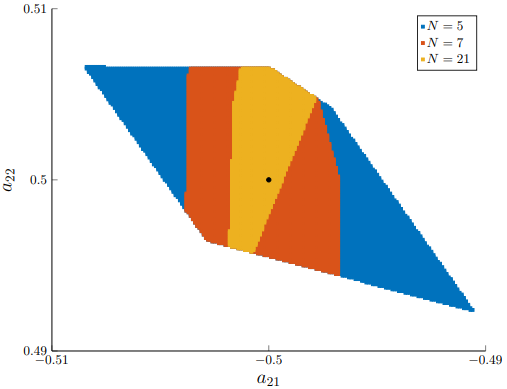
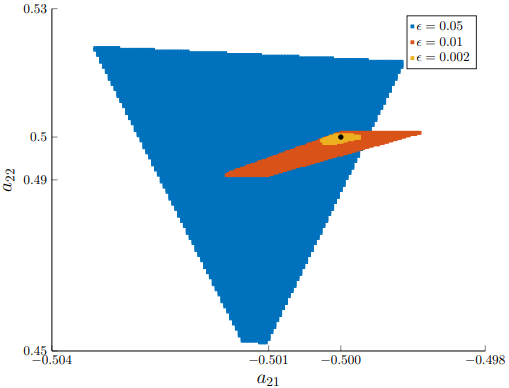

# Data Driven Dissipativity Verification for a Mass-Spring-Damper System
This repo provides code for Example 6.2.

## Dependencies
This code is developed and tested in MATLAB. You will need the following:

``` YAlMIP ```: Download at https://yalmip.github.io/download/

```MOSEK```: Download at https://www.mosek.com/. License can be requested at https://www.mosek.com/products/academic-licenses/. ```SeDuMi``` can be used alternatively (download at [SeDuMi download page](https://github.com/sqlp/sedumi)).

Make sure ``` YAlMIP ``` and solvers are installed and added to the MATLAB path.

## Demo with Mass-Spring-Damper

Run ```Dissipativity_verification.m``` to implement a data-driven verification by LMIs. More specifically, we first define the system dynamics, the dissipativity matrices, and check the dissipativity for the true underlying system. Second, the data is generated by simulating the system dynamics and adding random noise in ```simulate_system.m```. Based on the simulated trajectories, the data-driven verification of dissipativity is implemented. Pursuing for various data lengths, the script plots out the inference on the $\ell_2$-gain (Fig. 14) and input-feedforward passivity parameter (Fig. 15), respectively.


<table align="center">
  <tr>
    <td align="center"><b>Inferred Input-Forward Passivity Parameter</b></td>
    <td align="center"><b>Inferred <b>&#8467;<sub>2</sub>-gain</b></td>
  </tr>
  <tr>
    <td align="center"></td>
    <td align="center"></td>
  </tr>
</table>

Run ```Visualization_set_membership.m``` to generate visualization for set memberships (Fig. 13).
<h4 align="center">Projected Set Memberships</h4>
<div align="center">
  
</div>


