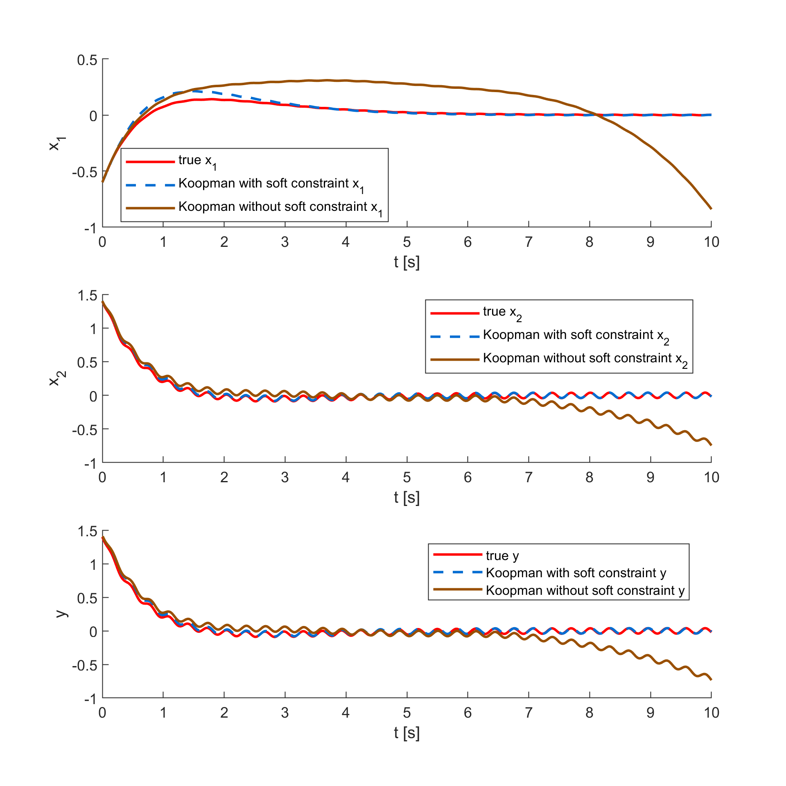

# Koopman Operator Learning on Duffing Oscillator with Soft Constraints to Enforce Stability
This repo provides code for Example 4.2.
## Dependencies
This code is developed and tested in MATLAB. You will need the following.

``` YAlMIP ```: Download at https://yalmip.github.io/download/ and 
add YALMIP to your MATLAB path. <pre> ```addpath(genpath('path_to_YALMIP_folder')) ``` </pre>
```MOSEK```: Download at https://www.mosek.com/. License can be requested at https://www.mosek.com/products/academic-licenses/.


## Demo with Duffing Oscillator
Run ```koopman_soft_stability.m``` to build a Koopman model using the thin-plate kernal and to train with data collected. 
We enforce stability by adding penalty term on the the spectral norm of the dynamic matrix A as a soft constraint. 
We simulate the system dynamics of the learned models both for the one with soft constraint and the one without, and compare them to the groundtruth.

