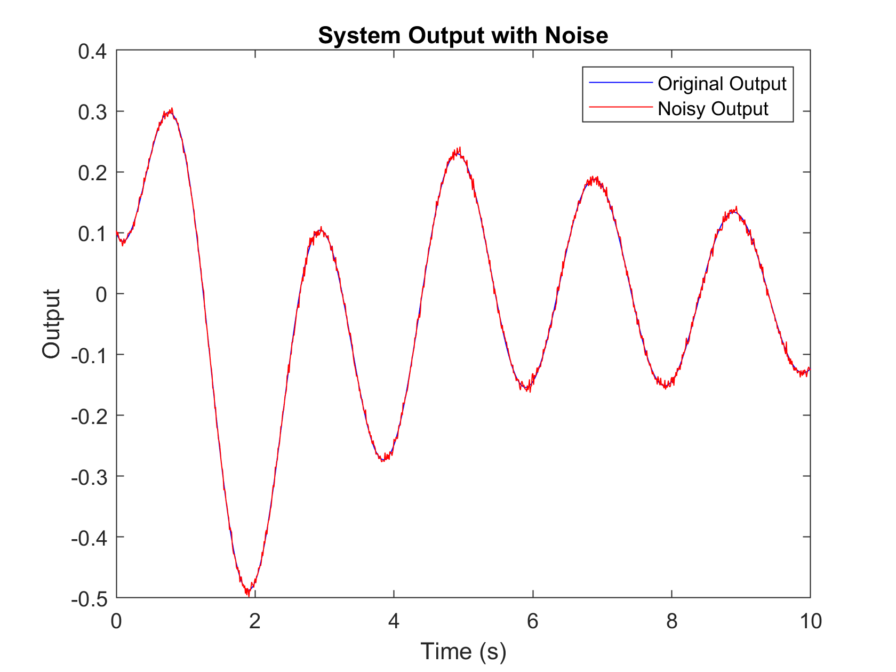
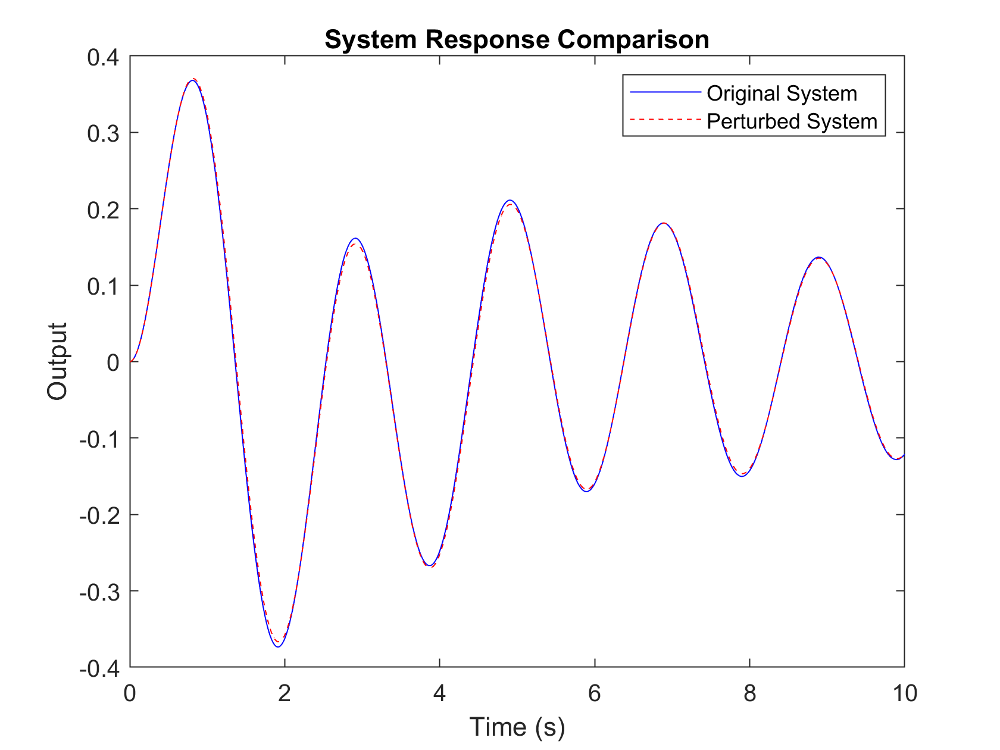

# Linear System Identification for RLC Circuits with Hard Passivity Enforcement via Perturbation Methods
This repo provides code for Example 4.1.

## Dependencies
This code is developed and tested in MATLAB.  
You will need the following toolboxes and packages:

```System Identification Toolbox```

``` YAlMIP ```: Download at https://yalmip.github.io/download/ and 
add it to your MATLAB path. <pre> ```addpath(genpath('path_to_YALMIP_folder')) ``` </pre>

```SeDuMi```: Download at [SeDuMi download page](https://github.com/sqlp/sedumi) and add it to your MATLAB path.  <pre> ```addpath(genpath('path_to_SeDuMi_folder')) ``` </pre>

## Demo with RLC Circuit
Run ```example_linear.m``` to identify a linear model for a RLC circuit, where resistor, inductor and capacitor are in series,  with passivity. 
We first use function *ssest* from the *System Identification Toolbox* in Matlab and identify a baseline system model. 
Then we perturb the output matrix C as least as possible to enforce hard constraints on passitivity. The final linear model is certified to be passive.
Note that the data used for identication is noisy. We compare the performance of the baseline system model and the perturbed system model and can see only minor changes in fit.
<div align="center">
  
  
</div>

The fit is also checked using *lsim* and it reports 95.23% for the fit goodness score on the final passive model.


