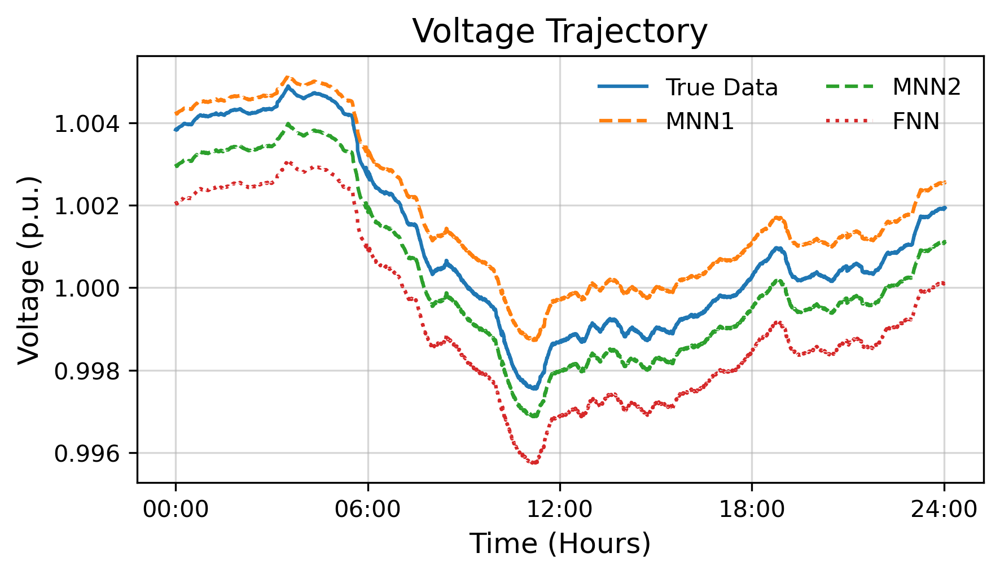

# Code for Example 5.2

This repository contains the source code and implementation for Example 5.2. It implements two monotone neural networks for voltage prediction.

All monotone network models are implemented in the `models.py` file.

***

## 📚 References

This implementation is based on concepts from the following papers:

* 'Monotone, Bi-Lipschitz, and Polyak-{\L}ojasiewicz Networks'
* 'Online Event-Triggered Switching for Frequency Control in Power Grids With Variable Inertia'
* 'Stability Constrained Reinforcement Learning for Decentralized Real-Time Voltage Control'

***

## 📋 Dependencies

The project requires the following packages:

* **Python** `3.8`
* **PyTorch** `2.2.0`
* **Pandapower**
* **Matplotlib**
* **Gymnasium**
* **Numba**

***

## ⚙️ Installation

1.  **Create the Conda Environment**
    ```bash
    conda create -n power-sysid python=3.8
    ```

2.  **Activate the Environment**
    ```bash
    conda activate power-sysid
    ```

3.  **Install Packages**
    It's recommended to install the PyTorch package first, followed by the others.

    ```bash
    # Install PyTorch with CUDA 11.8
    conda install pytorch==2.2.0 torchvision==0.17.0 torchaudio==2.2.0 pytorch-cuda=11.8 -c pytorch -c nvidia
    
    # Install remaining packages
    conda install matplotlib numba
    pip install pandapower gymnasium
    ```

***

## ▶️ Usage

To train the model and generate the visualization, run the `train_and_visualization.py` script from the project's root directory.

```bash
python train_and_visualization.py
```
