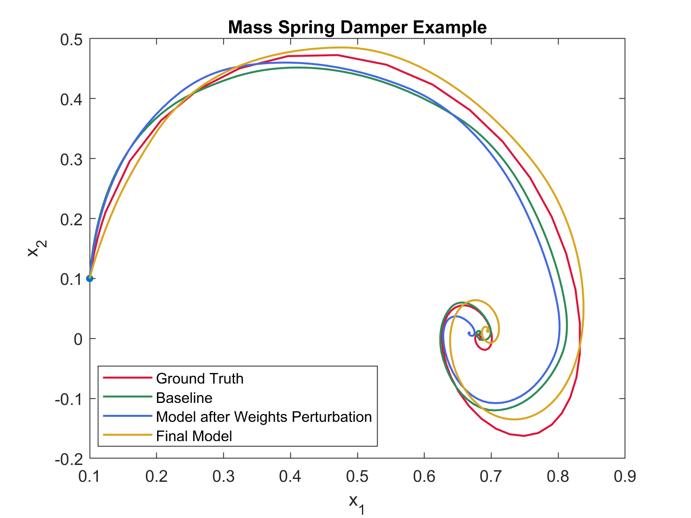

# Nonlinear System Identification for a Mass-Spring-Damper System Using Neural Networks with Hard Dissipativity Enforcement via Perturbation
The repo provides the code for Example 5.3.

## Dependencies
The code includes scripts both in Python 3.8+ and MATLAB. 

In Python:  ```numpy``` ```pandas``` ```Pytorch``` ```matplotlib```  ```mat4py```

One can install the dependencies directly via pip:
``` pip install numpy pandas torch matplotlib mat4py ```

In MATLAB: 

``` YAlMIP ```: Download at https://yalmip.github.io/download/.

```PENLAB```: Download at https://tomopt.com/docs/penlab/.

Make sure ``` YAlMIP ``` and ```PENLAB``` are installed and added to the MATLAB path.

## Demo with Mass-Spring-Damper
Run ```neural_ode.py``` to obtain the baseline model with data collected from a Mass-Spring-Damper trajectory. 
The weights and biases for the baseline model are stored in ```./Results/weights_4164_3000_actv01_nolast.mat``` and ```./Results/biases_4164_3000_actv01_nolast.mat``` respectively.
Then run ```M1MLmethod``` to perturb the weights so that the model is certified to be incrementally dissipative. The perturbed weights are stored in ```./Results/weights_adjusted.mat```. 
Lastly, we retrain the biases using ```bias_retraining.py``` to retain the fitting ability while maintaining dissipativity. The retrained biases are stored in 
```./Results/retrained_biases_4164_4000_actv01_nolast.mat```. With trained model, run ```afteradjust.m``` to plot out the performance of he ground truth, the fit for baseline model, model
after weights perturbation and final model respectively.




