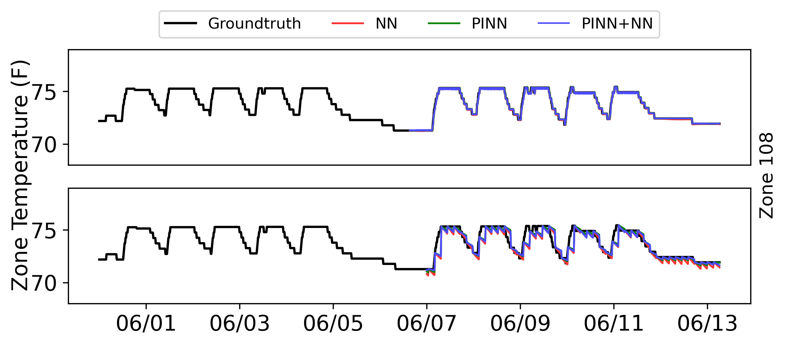

# Code for Example 5.4

This repository contains the source code and implementation for Example 5.4, demonstrating the performance of PINN, combined PINN and NN, and standard NN.

***

## Dependencies 📋

The project is built with the following libraries:

* **Python** `3.8`
* **PyTorch** `2.2.0`
* **NumPy**
* **Matplotlib**

***

## ⚙️ Installation

Follow these steps to set up the Conda environment and install the required packages.

1.  **Create and Activate the Conda Environment**
    First, create a new environment named `pinn-building` with Python 3.8.
    ```bash
    conda create -n pinn-building python=3.8
    ```
    Next, activate the newly created environment.
    ```bash
    conda activate pinn-building
    ```

2.  **Install Dependencies**
    Install PyTorch, its related libraries, and Matplotlib using the following commands. Ensure you have a compatible NVIDIA GPU and CUDA toolkit for the `pytorch-cuda` package.

    ```bash
    # Install PyTorch with CUDA 11.8 support
    conda install pytorch==2.2.0 torchvision==0.17.0 torchaudio==2.2.0 pytorch-cuda=11.8 -c pytorch -c nvidia
    
    # Install Matplotlib and NumPy
    conda install matplotlib numpy
    ```

***

## ▶️ Usage

To train the model and generate the visualization, run the `train_and_visualization.py` script from the root directory of the project.

```bash
python train_and_visualization.py
```
