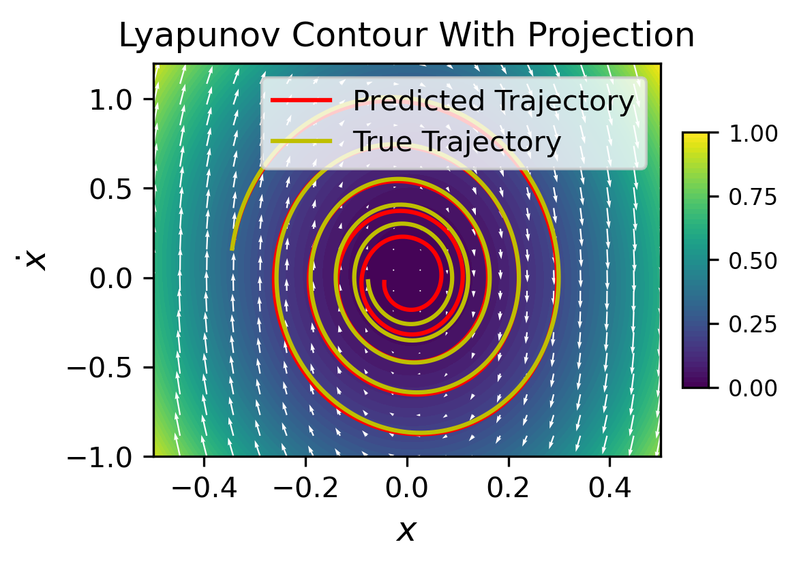

# Stable Dynamics Models for Example 5.5

This repository contains the source code and implementation for Example 5.5, demonstrating and comparing the performance of several stable dynamics models on an n-link pendulum simulation. For simplicity, we focus on the simple pendulum in the training.

***

### Models Implemented

Three different modeling approaches are considered:

* **Simple NN**: A standard neural network without stability constraints.
* **Lyapunov (Projection)**: A neural network where stability is enforced by projection, using an ICNN-based Lyapunov function.
* **Lyapunov (Soft Penalty)**: A neural network where stability is enforced via a soft penalty in the loss function.

***

## 📋 Dependencies

The project is built with the following libraries:

* **Python** `3.8`
* **PyTorch** `2.2.0`
* **NumPy**
* **Matplotlib**
* **SciPy**

***

## ⚙️ Installation

1.  **Create and Activate the Conda Environment**
    ```bash
    conda create -n Stable-dynamics python=3.8
    conda activate Stable-dynamics
    ```

2.  **Install Packages**
    Install PyTorch first, followed by the other required libraries.
    ```bash
    # Install PyTorch with CUDA 11.8 support
    conda install pytorch==2.2.0 torchvision==0.17.0 torchaudio==2.2.0 pytorch-cuda=11.8 -c pytorch -c nvidia
    
    # Install remaining packages from conda
    conda install matplotlib scipy
    ```

***

## 📂 Code Overview

* `env.py`: Implements the n-link pendulum simulation environment.
* `model.py`: Provides the ICNN implementation for Lyapunov functions and other necessary neural network architectures.
* `train_and_visualization.py`: The main script to train the models and generate visualizations.

***

## ▶️ Usage

To train all models and generate the comparison plots, run the main script from the project's root directory:
```bash
python train_and_visualization.py
```
