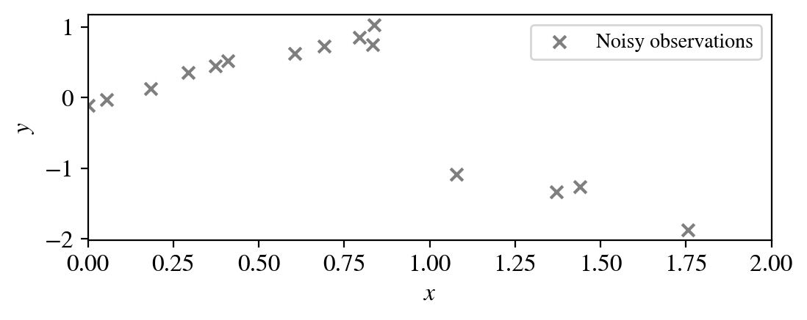
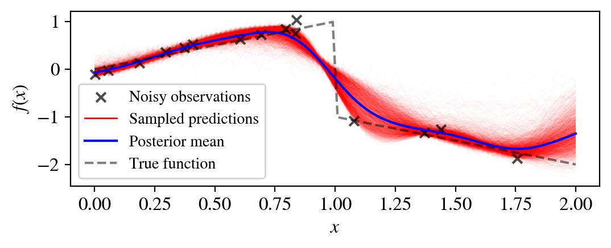
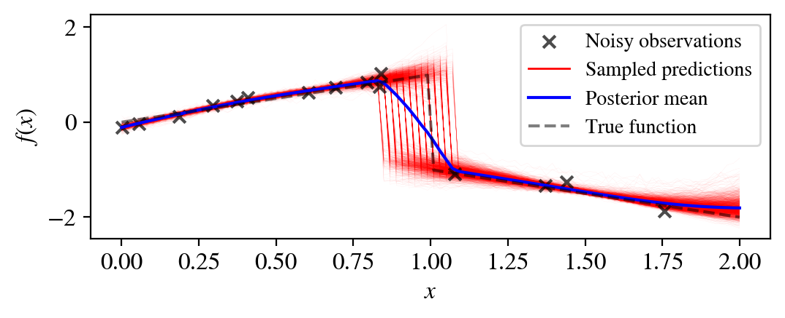

# Structured Gaussian Process (GP) Regression for Example 4.3

This repository contains the source code and implementation for Example 4.3, demonstrating and comparing the performance of vanilla (unstructured) and structured GP regression models in learning a piecewise-linear dynamics function.

***


## 📋 Dependencies

The project is built with the following libraries:

* **Python** `3.10`
* **GPax**
* **NumPy**
* **Matplotlib**
* **SciPy**

***

## ⚙️ Installation

1.  **Create and Activate the Conda Environment**
    ```bash
    conda create -n gpax_env python=3.10
    conda activate gpax_env
    ```

2.  **Install Packages**
    ```bash
    pip install gpax matplotlib numpy
    ```

***

## ▶️ Demo

* `structured_GP.ipynb`: A Python notebook for training both unstructured and structured GP models with data generated from the ground-truth model.

**A dataset of 15 data points are generated from the ground-truth dynamics:**



**An standard (unstructured) GP model does not learn the dynamics well, due to the discontinuity of the piecewise-linear dynamics:**



**Meanwhile, a structured GP model, that encodes the piecewise-linearity of the model, is able to learn the dynamics more accurately.**



***

